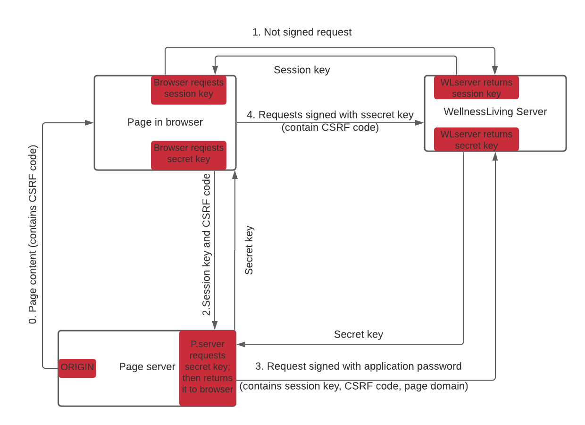

JS SDK uses the following steps for authentication without application password and with CSRF protection:

1. At first, browser sends a request of **weak notepad** to WellnessLiving server (CORS request).  
  Request has no signing.  
  WellnessLiving server checks request header `Origin` to be one of registered domains.
  Then returns a **weak notepad**.

2. Then browser sends a request of **strong notepad** to page server.
  The **weak notepad** and **code of protection from CSRF** are sent with the request.  
  CSRF code must be generated by page server when it generates the page for a browser.  

3. Page server checks correctness of CSRF code.  
  Then it sends request to WellnessLiving server.  
  The request contains the **weak notepad**, **CSRF code** and **page domain**.
  The request must be signed using application password. 
  (Yes, the API uses application password, but JS SDK does not use it.)  
  WellnessLiving server returns a strong notepad.  
  After page server gets response, it returns a **strong notepad** to browser.

4. Browser signs all next requests to WellnessLiving server with the **strong notepad**.  
  Note that you can use the strong notepad only in the seme session where you got the weak notepad.

This way provides 3 levels of protection:

1. Server accepts CORS requests from certain domains only. Hence, hacker cannot get session key.
1. API on the page server that provides a secret key is CSRF protected.
  Hence, hacker cannot get a secret key.
1. It is necessary to know CSRF code to send a request signed with secret key.
  Hence, hacker cannot use a secret key.

